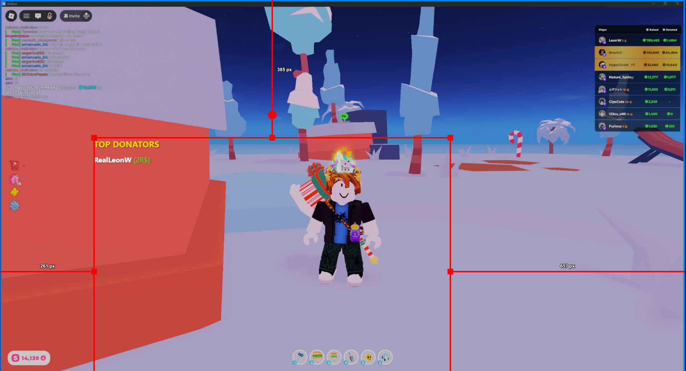
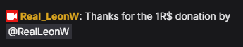

# PLS DONATE Offline Overlay Manager

A lightweight, local tool to track [PLS DONATE](https://www.roblox.com/games/8737602449/PLS-DONATE) donations in real-time and display a live **Leaderboard** overlay in OBS Studio.



## Features

*   **Real-time Tracking**: Connects directly to the PLS DONATE WebSocket API.
*   **Live Leaderboard**: Automatically sorts and displays top donors for the current session.
*   **OBS-Ready**: Text-only, transparent background designed to be added as a Browser Source.
*   **Auto-Save**: Remembers your Roblox User ID and settings between restarts.
*   **Chat Integration**: Automatically sends "Thank You" messages to Twitch and YouTube live chat.



## Installation

### Option 1: Standalone App (Recommended)
1.  Download the latest `PLS DONATE Overlay.exe` from the releases.
2.  Double-click to run. No installation required.
    *   *Note: Settings are saved in your AppData folder, so you can move the EXE anywhere.*

### Option 2: Run from Source
1.  Ensure you have **Python 3.7+** installed.
2.  Install the required dependencies:
    ```bash
    pip install -r requirements.txt
    ```

## Usage

1.  Start the application (Run EXE or `python app.py`).
2.  The dashboard window will open automatically.
3.  **Setup**:
    *   Enter your **Roblox User ID**.
    *   (Optional) Configure **Twitch/YouTube Chat** integration in the new section.
    *   Click **Save & Connect**.
4.  Copy the **Leaderboard Link** provided on the dashboard.
5.  In **OBS Studio**:
    *   Add a new **Browser Source**.
    *   Paste the link.
    *   Set the Width/Height as needed (e.g., 400x600).
    *   The background is transparent by default.

## Stream Integration

You can configure the bot to send messages like:
> Thanks for the 100R$ donation by @LeonW

### Twitch Setup
1.  Get an OAuth Token from [https://twitchapps.com/tmi/](https://twitchapps.com/tmi/).
2.  Enter the token (starts with `oauth:...`) and your Channel Name.

### YouTube Setup
1.  Requires a valid **OAuth Access Token** with `youtube` scope.
2.  Enter the token in the dashboard.
    *   *Note: Access tokens expire quickly (1 hour). This feature requires generating a new token for each session or implementing a full OAuth flow.*

## Leaderboard Format

The leaderboard displays donors in the following format:
```
Username (AmountR$)
```
*Example:* `LeonW (100R$)`
